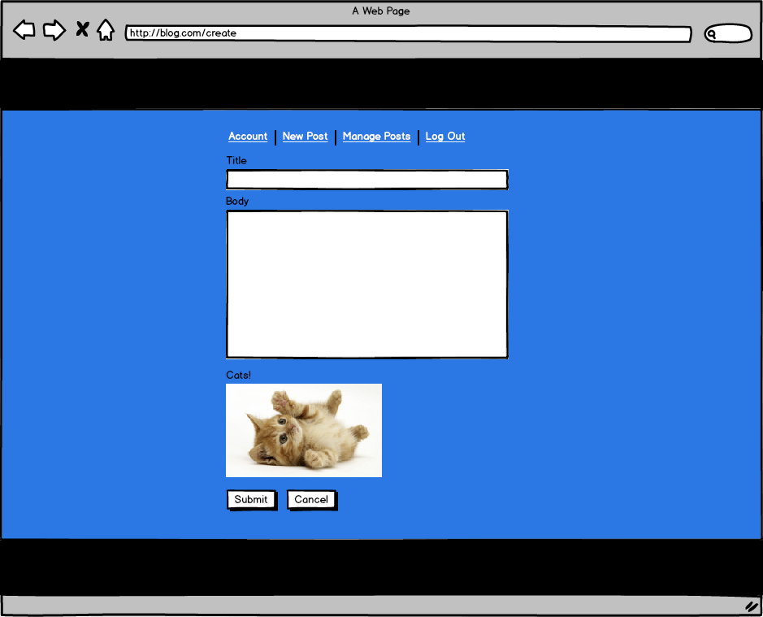

[//]: <> (author: Benjamin White)
[//]: <> (type: challenge)
[//]: <> (time: 120)

# Web Basics Coding Challenge

To close out this lesson, you'll complete a simple front end basics coding challenge. You will need to write HTML and CSS that implements the following sketch:

If you can code this simple sketch from scratch in an hour or less, you'll do well when we start working with templating and Bootstrap later in this course.

## Project Requirements

*   Your page must decently approximate the sketch above, and it should behave reasonably when users resize the browser.
*   Each of the items in the top nav bar is a link. You don't need to create pages for each link, just a page for this sketch.
*   The title and body field are required. You should enforce this using the HTML5 required attribute on these fields.
*   The cat image has no functionality in the form, it's there just to test your HTML/CSS skills. 
*	You should use Git and Github to save your app. When you've completed the challenge, please push your commit up to Github.com, create a GH-pages branch to host the page, and share a link to the repo and the GH page with your mentor, who will let you know if you've passed the challenge. If you need instructions on how to host static web pages using gh-pages branches, follow [this guide](https://pages.github.com/). To get the relevant instructions, select the "Project Site" and "Start from Scratch" options.
*    The cat image asset is available here: 
    
    

