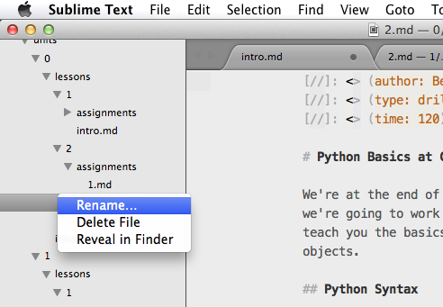
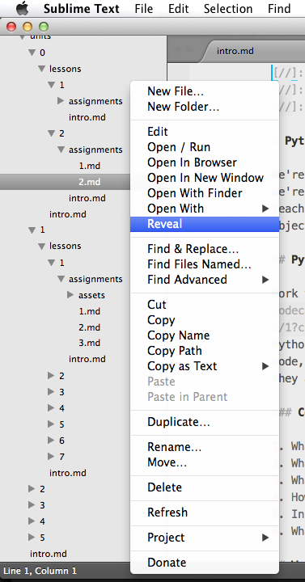

[//]: <> (time: 30)
[//]: <> (type: task)
[//]: <> (author: Benjamin E White)

#  Sublime Text Setup
##### 30 minutes

In the introduction to this course, we asked you to [install Sublime Text 3](http://www.sublimetext.com/3) if you don't already have a preferred text editor. In addition to being a great text editor out of the box, there are a large number of publicly-available plugins for Sublime Text that can improve and speed up your coding process. 

In this assigment, we're going to walk you through installing four of these plugins:

*   [Package Manager](https://sublime.wbond.net/installation) for managing your Sublime Text plugins
*   [Emmet](https://github.com/sergeche/emmet-sublime) which offers tab completion for HTML files. This will come in handy when we start to build web apps later in this course. 
*   [Sidebar Enhancements](https://github.com/titoBouzout/SideBarEnhancements), which expands the menu options when you right click on your file tree in the left panel of Sublime Text. 

<note>**Note:** If you're using Nitrous.io for your development platform in this class, you have two main options for writing your code. On the one hand, you can use the built in IDE in the Nitrous.io platform -- you can do everything you need to do for this course using it. On the other hand, you can take advantage of Nitrous.io's folder syncing feature to edit your Nitrous projects with a text editor on your local computer, and then have the changes you make sync with your Nitrous box. If you're a PC user, you can download the Nitrous.io desktop app [here](https://www.nitrous.io/desktop#windows), and you can learn how to edit your files locally [here](http://help.nitrous.io/nitrous-desktop-win/#file-sync).  If you're a PC user, you can download the Nitrous.io desktop app [here](https://www.nitrous.io/desktop#mac), and you can learn how to edit your files locally [here](http://help.nitrous.io/nitrous-desktop/#file-sync).</note>

## Package Manager

The first plugin we need to install is Package Manager, which we'll then use to install the remainder of our plugins. Install Package Manager is easy enough: just follow the official instructions [here](https://sublime.wbond.net/installation#st3).

## Emmet 

Let's install Emmet, which helps you with tab completion. For instance, when you’re working on an HTML file, you can simply type “!” followed by TAB, and you’ll automatically get this code:

```xml
<!doctype html>
<html lang="en">
<head>
<meta charset="UTF-8">
<title>Document</title>
</head>
<body>
 
</body>
</html>
```

Another really helpful shortcut is lorem. When you type this and then hit tab, Emmet will generate lorem ipsum filler text that looks like this:

*Lorem ipsum dolor sit amet, consectetur adipisicing elit. Illum, quod, commodi vel iste qui consequuntur minus eligendi soluta delectus nihil consectetur quos dignissimos quibusdam deserunt sint optio neque placeat odit?*

Designers commonly use lorem ipsum text when they don’t yet have the copy written for a particular section.

To install Emmet:

-   On Mac, do `Cmd-Shift-p` to get the Command Palette. On Windows, do Ctrl-Shift-P.
-   Inside of the Command Palette, type “Install package” and then select the `Package Control: Install Package` option
-   In the install package dialogue box, type in "emmet", then hit return. After Emmet installs, pay attention to the output. You may need to restart Sublime Text or change some setting, and this output will let you know.
-   After you’ve installed Emmet, take a look at the [docs](http://docs.emmet.io/), and be sure to watch the short demo video at the top of the page. 
-   Also, have a look at this Emmet [cheat sheet](http://docs.emmet.io/cheat-sheet/) to get a sense of some of the useful shortcuts (in particular, be sure to look at the HTML shortcuts). 

## Install Sidebar Enhancements

[Sidebar Enhancements](https://github.com/titoBouzout/SideBarEnhancements)
expand the commands you can access by right clicking in the left sidebar of Sublime Text. Below is the sidebar options you get out of the box:



Here's what you get after installing this plugin:



To install Sidebar Enhancements, we'll use the same process as we did for Emmet. First run `Cmd-Shift-p` to access the Command Pallette, then type in "sidebar" and choose SidebarEnhancements from the options. After it installs, you'll be able to see the expanded list of sidebar options if you right click in the sidebar area.


